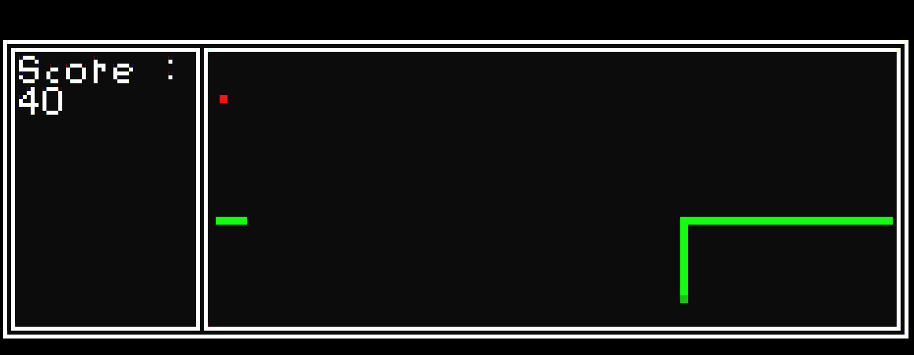

# Game Snake
Actually, it is a Game Engine on the CMD, used for creating simple games on the CMD using the C language, similar to the snake game that was provided for testing.

## How to Control and Play
- Press Q to exit the menu or pause the game
- wasd to control direction
- Press ESC to exit the game
## How to Compile
```bash
gcc Game_Snake.c -o Game.exe -Wall
```
